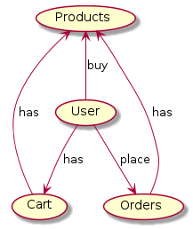
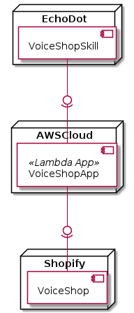
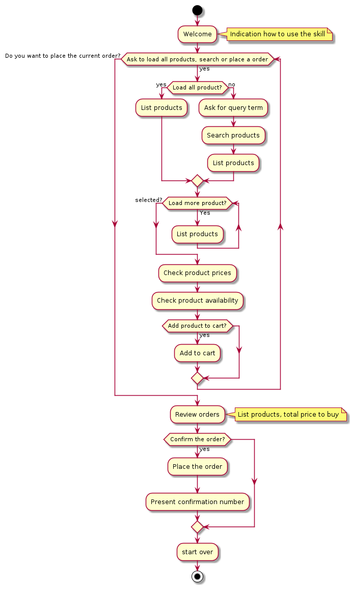
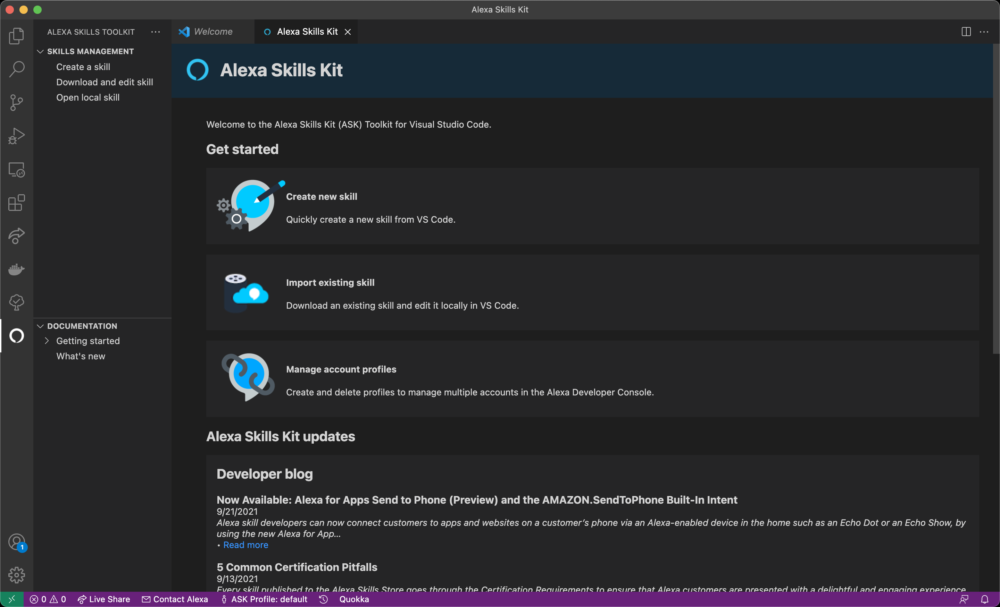
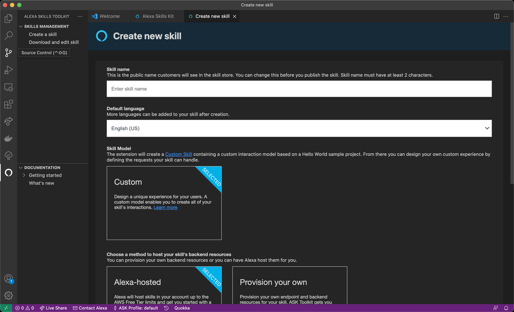
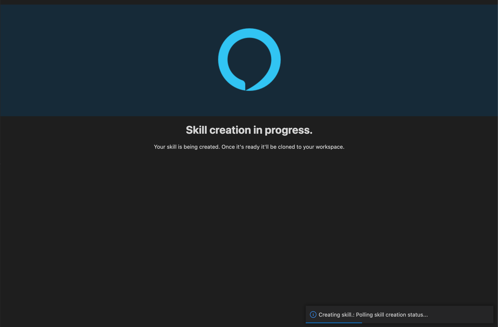
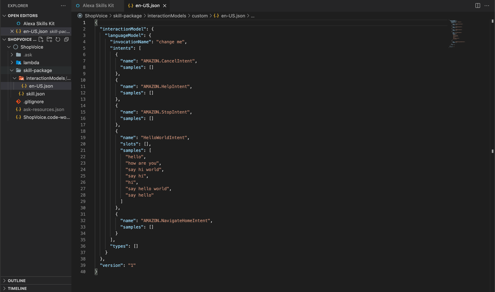
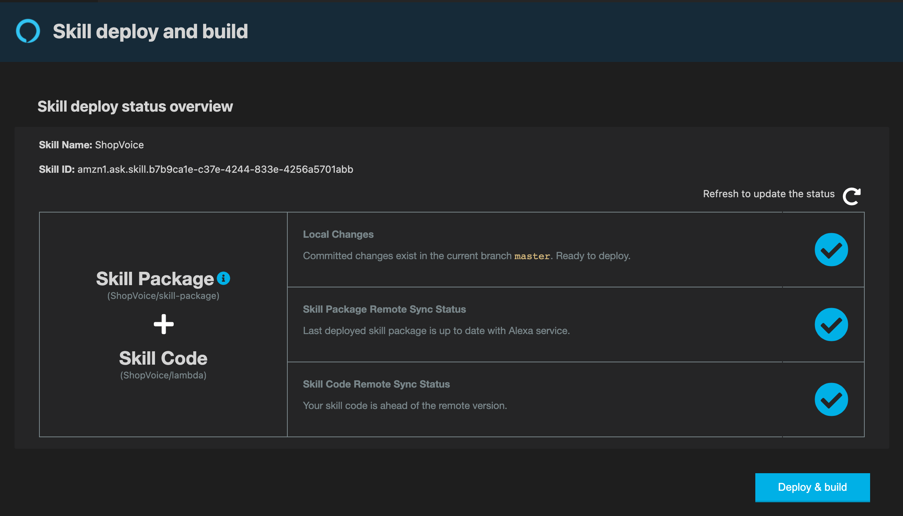
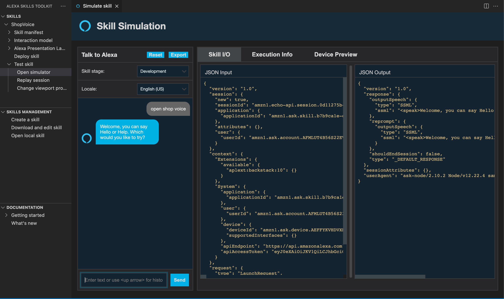
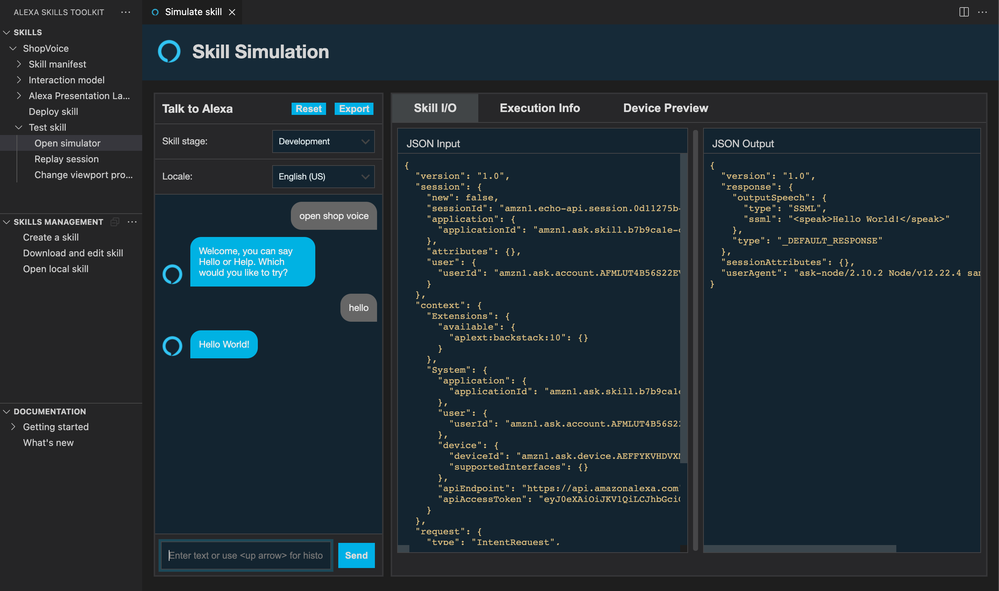

# Project #1 - Shopping Voice Service

## Participants

```
Lorna Flerida Espinisa Cuello / 20145845
Dante Faña Badia / 20156079
```

## Document Purpose

This document has as purpose to define in big scale all project decision and components, also have the documentation of the project.

### Audience

- Professor and monitors: to evaluate and get feedbacks from them.
- Peers students: to share knowledge and ideas.

### Solution Overview

This Project consists of a voice command assistant that will allow you to make online purchases in an online store site based on Shopify.

The Alexa-based device should be a channel for requests to add products to the shopping cart.

#### Uses cases

##### Must have 
- Add product to shopping cart 
- Check product prices 
- Check product availability
- Simulate online purchase checkout

##### Nice to have 
- List products (5 by 5)
- Search products

## Deliverable 1

### Goals

- Define the technology stack 
- Define the solution overview 
- Document the reason of the technology selection 

#### Domain 



#### Components



#### Flow/Voice UI 



### Technology Stack

Here is technology stack benchmark and selection.

<table>
  <thead>
    <tr>
      <th>Decision</th>
      <th>Alts</th>
      <th>Pros</th>
      <th>Cons</th>
    </tr>
  </thead>
  <tbody>
    <tr>
      <td>Programming language: node</td>
      <td>
        <ul>
          <li>Java</li>
          <li>C#</li>
          <li>JavaScript</li>
			<li>Python</li>
        </ul>
      </td>
      <td>
        <ul>
          <li>Developer knowledge</li>
          <li>Native support</li>
          <li>Simplicity</li>
          <li>Modern code approach</li>          
        </ul>
      </td>
      <td>
        <ul>
          <li>n/a</li>
        </ul>
      </td>
    </tr>
    <tr>
      <td>REST Admin Shopify API</td>
      <td>
        <ul>
          <li>GraphQL API</li>
          <li>Storefront API</li>
        </ul>
      </td>
      <td>
        <ul>
          <li>Simplicity</li>
          <li>Big community</li>
        </ul>
      </td>
      <td>
        <ul>
          <li>It has some use quote but for this POC the number of user will be low</li>
        </ul>
      </td>
    </tr> 
    <tr>
      <td>AWS ASK CLI</td>
      <td>
        <ul>
          <li>Serverless</li>
			<li>SAM</li>
        </ul>
      </td>
      <td>
        <ul>
          <li>AWS Community</li>
          <li>CloudFormation compatible</li>
          <li>Official AWS Support</li>
          <li>Has VS Code integration, so we can use code first approach to create our skill</li>          
        </ul>
      </td>
      <td>
        <ul>
          <li>Is only possible to use for Alexa skill, not is a standard tool</li>
        </ul>
      </td>
    </tr>
  </tbody>
</table>

## Deliverable 2

### Goals

- Create a basic skill 
- Documented the skill creation

### Overview

For the skill creation we're using the Alexa ASK CLI, this tool allows us to create the skill using code first approach, this mean that we don't need to get out of our editor/IDE to build the skill. 

For test purpose, we only code a simple skill that make Alexa say "hello world".

### Pre-conditions

Before start the creation of this skill, you must have the tools installed and tasks completed following.

#### Tasks

- AWS Account
- Amazon Developer Account 

#### Tools 

- VS Code 
- Alexa Skills Kit (ASK) Toolkit
- ASK CLI AWS 

### Skill Creation Documentations

#### 1 - Open Alexa Skill Kit

Here we open ours skill kit tool that allow us to create, setup, deploy and development.



#### 2 - Skill Creation Setup

Here we set up the skill: technology, template and folder.



#### 3 - Creating Skill

Here we're waiting to ours CLI create all resources in AWS.



#### 4 - Change Invocation World

Firs for creating ours skill, we need to change ours invocation world.



#### 5 - Deploy Setup

Here we check ours skill before the deployment.



#### 6 - Deploying

Here we're waiting to ours CLI update all resources in AWS and ours skill code.


#### 7 - Testing Invocation World

Using the skill kit to test ours invocation world to open ours skill.



#### 8 - Testing Hello World Intent 

Then we test ours skill, basic intent.

